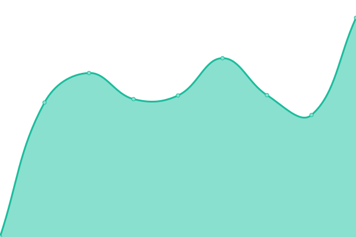

# [📈 Live Status](https://pixelstrolch.github.io/upptime): <!--live status--> **🟩 All systems operational**

This repository contains the open-source uptime monitor and status page for [Stefan Brechbühl](https://www.pixelstrol.ch/), powered by [Upptime](https://github.com/upptime/upptime).

With [Upptime](https://upptime.js.org), you can get your own unlimited and free uptime monitor and status page, powered entirely by a GitHub repository. We use [Issues](https://github.com/pixelstrolch/upptime/issues) as incident reports, [Actions](https://github.com/pixelstrolch/upptime/actions) as uptime monitors, and [Pages](https://pixelstrolch.github.io/upptime) for the status page.

<!--start: status pages-->
<!-- This summary is generated by Upptime (https://github.com/upptime/upptime) -->
<!-- Do not edit this manually, your changes will be overwritten -->
<!-- prettier-ignore -->
| URL | Status | History | Response Time | Uptime |
| --- | ------ | ------- | ------------- | ------ |
|  [stebre.ch](https://stebre.ch) | 🟩 Up | [stebre-ch.yml](https://github.com/pixelstrolch/upptime/commits/HEAD/history/stebre-ch.yml) | 

 133ms
     
 | 

<a href="https://pixelstrolch.github.io/upptime/history/stebre-ch">100.00%</a>
    

|  [accessible-pdf.info](https://accessible-pdf.info) | 🟩 Up | [accessible-pdf-info.yml](https://github.com/pixelstrolch/upptime/commits/HEAD/history/accessible-pdf-info.yml) | 

 202ms
     
 | 

<a href="https://pixelstrolch.github.io/upptime/history/accessible-pdf-info">100.00%</a>
    

|  [creationeliane.ch](https://creationeliane.ch) | 🟩 Up | [creationeliane-ch.yml](https://github.com/pixelstrolch/upptime/commits/HEAD/history/creationeliane-ch.yml) | 

 3126ms
     
 | 

<a href="https://pixelstrolch.github.io/upptime/history/creationeliane-ch">100.00%</a>
    

|  [familienverein-wahlen.ch](https://familienverein-wahlen.ch) | 🟩 Up | [familienverein-wahlen-ch.yml](https://github.com/pixelstrolch/upptime/commits/HEAD/history/familienverein-wahlen-ch.yml) | 

 250ms
     
 | 

<a href="https://pixelstrolch.github.io/upptime/history/familienverein-wahlen-ch">100.00%</a>
    

<!--end: status pages-->

[**Visit our status website →**](https://pixelstrolch.github.io/upptime)

## 📄 License

- Powered by: [Upptime](https://github.com/upptime/upptime)
- Code: [MIT](./LICENSE) © [Stefan Brechbühl](https://www.pixelstrol.ch/)
- Data in the `./history` directory: [Open Database License](https://opendatacommons.org/licenses/odbl/1-0/)
